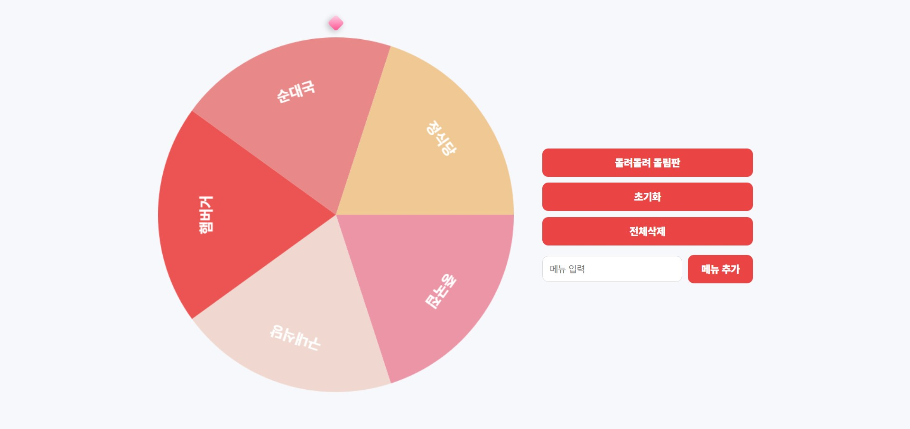

# 🎯 Random Roulette (식사 메뉴 룰렛)

HTML + CSS + Vanilla JavaScript 기반으로 제작한  
Canvas 기반 랜덤 룰렛 웹 페이지입니다.

사용자가 직접 메뉴를 추가하여 돌림판을 회전시킬 수 있으며,  
결과는 모달 형태로 표시됩니다.

간단한 UI와 직관적인 조작을 목표로 제작한  
미니 프로젝트입니다.

---

## 🌐 배포 주소

Vercel을 통해 배포되었습니다.

👉 https://random-roulette-dusky.vercel.app/

---

## ✨ 주요 기능

### 🎡 룰렛 회전

- Canvas 기반 원형 룰렛 렌더링
- 버튼 클릭으로 회전 실행
- 회전 중 중복 실행 방지 처리
- 결과 모달 표시

### ➕ 메뉴 관리

- 메뉴 직접 추가
- 전체 삭제 기능
- 초기 기본 메뉴 제공
- 메뉴 2개 미만 시 안내 메시지 출력

### 📢 결과 출력

- 당첨 메뉴 모달 표시
- 확인 버튼으로 모달 닫기

---

## 🛠 사용 기술

- HTML
- CSS
- Vanilla JavaScript
- Canvas API
- Vercel

---

## 📂 프로젝트 구조

```
random_roulette/
├─ index.html
├─ style.css
├─ app.js
└─ README.md
```

---

## 🚀 실행 방법 (로컬)

index.html 파일을 브라우저로 열거나  
VS Code Live Server 사용을 권장합니다.

---

## 🎨 UI 컨셉

- 원형 룰렛 중심 인터페이스
- 심플한 버튼 조작
- 결과 모달 피드백
- 파스텔 톤 색상 구성

---

## 📸 Preview



---

## 📌 앞으로 추가해보고 싶은 기능

- localStorage 메뉴 저장
- 사운드 효과 추가
- 모바일 UI 최적화

---

## 🙋‍♀️ 제작자 GitHub

https://github.com/sungminjung066-lang
